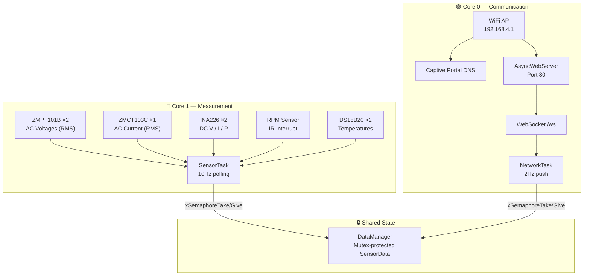

<h1 align="center">🌬️ ESP32 Wind Generator Monitoring System</h1>

<p align="center">
  <strong>Real-time portable wind turbine monitoring with a premium glassmorphism web dashboard, dual-core FreeRTOS architecture, and GitHub Pages demo mode.</strong>
</p>

<p align="center">
  
  
  
  
</p>

---

## 📋 Table of Contents

- [Overview](#-overview)
- [System Architecture](#-system-architecture)
- [Hardware & Wiring](#-hardware--wiring)
- [Project Structure](#-project-structure)
- [Getting Started](#-getting-started)
- [Calibration](#-calibration)
- [Demo Mode — GitHub Pages](#-demo-mode--github-pages)
- [Troubleshooting](#-troubleshooting)

---

## 🔭 Overview

This firmware transforms an ESP32-WROOM-32D development board into a self-contained wind turbine diagnostic station. It monitors both the AC generator output and DC rectified power, along with RPM and temperatures.

**No internet or cloud required.** Connect directly to the ESP32's WiFi AP and access the dashboard at `http://192.168.4.1/`.

### Key Features

| Feature | Description |
|---|---|
| **Dual-Core FreeRTOS** | Sensor sampling on Core 1, networking on Core 0 |
| **AC Monitoring** | ZMPT101B ×2 (voltage), ZMCT103C ×1 (current), AC power estimation |
| **DC Monitoring** | INA226 ×2 (voltage, current, power via I2C) |
| **RPM** | IR sensor with interrupt-based pulse counting |
| **Temperature** | DS18B20 ×2 on shared OneWire bus |
| **Web Dashboard** | Glassmorphism UI with WebSocket real-time updates |
| **Demo Mode** | Auto-simulated data when hosted on GitHub Pages |
| **Modular Drivers** | Each sensor is an independent, testable class |
| **Signal Processing** | True RMS calculation + moving average filtering |

---

## 🏗️ System Architecture



---

## 🔌 Hardware & Wiring

### Bill of Materials

| Component | Qty | Purpose |
|---|---|---|
| ESP32-WROOM-32D (DevKit V4) | 1 | Main controller |
| ZMPT101B | 2 | AC voltage sensing |
| ZMCT103C | 1 | AC current sensing |
| INA226 | 2 | DC voltage/current/power |
| DS18B20 | 2 | Temperature monitoring |
| IR Sensor Module | 1 | RPM measurement |

### Pin Mapping

| Component | GPIO | Protocol | Notes |
|---|---|---|---|
| **ZMPT101B #1** | `GPIO 34` | ADC1 | AC voltage (for power calc) |
| **ZMPT101B #2** | `GPIO 35` | ADC1 | AC voltage (raw monitoring) |
| **ZMCT103C** | `GPIO 32` | ADC1 | AC current |
| **RPM (IR)** | `GPIO 27` | Interrupt | Pulse counting |
| **INA226 #1** | `GPIO 21/22` | I2C (0x40) | DC channel 1 |
| **INA226 #2** | `GPIO 21/22` | I2C (0x41) | DC channel 2 |
| **DS18B20 ×2** | `GPIO 4` | OneWire | Shared bus |

> **Important:** All analog sensors use ADC1 pins. ADC2 is disabled when WiFi is active.

---

## 📁 Project Structure

```
MonitoringESP32/
├── platformio.ini
├── README.md
├── Log.md
├── .gitignore
│
├── src/
│   ├── main.cpp                    # Entry point (bootstraps FreeRTOS)
│   ├── config/
│   │   ├── config.h                # Calibration, timing, feature flags
│   │   └── pin_config.h            # GPIO assignments
│   ├── system/
│   │   ├── freertos_tasks.cpp/h    # Dual-core task orchestration
│   │   └── data_manager.cpp/h      # Thread-safe sensor data store
│   ├── sensors/
│   │   ├── zmpt101b.cpp/h          # AC voltage (RMS)
│   │   ├── zmct103c.cpp/h          # AC current (RMS)
│   │   ├── ina226_sensor.cpp/h     # DC power (I2C)
│   │   ├── ds18b20_sensor.cpp/h    # Temperature (OneWire)
│   │   └── rpm_sensor.cpp/h        # RPM (interrupt)
│   ├── network/
│   │   ├── wifi_manager.cpp/h      # WiFi AP + STA
│   │   └── web_server.cpp/h        # ESPAsyncWebServer + WebSocket
│   └── utils/
│       └── filters.cpp/h           # Moving average filter
│
├── data/                           # MASTER frontend (LittleFS)
│   ├── index.html
│   ├── style.css
│   └── script.js
│
├── tools/                          # Utility tools & scripts
│   ├── serial_logger/
│   │   └── serial_reader.py        # ESP32 serial reader & logger script
│   ├── upload_clean.ps1            # Custom clean upload script (PowerShell)
│   └── upload_clean.bat            # Custom clean upload script (Batch)
│
└── docs/                           # Synced copy for GitHub Pages
    ├── index.html
    ├── style.css
    ├── script.js
    ├── README.md
    └── Log.md
```

---

## 🚀 Getting Started

### Prerequisites
- VS Code with PlatformIO extension
- USB cable for ESP32

### Clean Upload Utility (Recommended)
To perform a complete clean flash (wiping existing programs and configuration data before flashing new firmware and LittleFS web pages), you can use the custom scripts in the `tools/` directory:

* **Using PowerShell (Windows)**:
  ```powershell
  # Auto-detect port:
  .\tools\upload_clean.ps1
  
  # Specify custom COM port:
  .\tools\upload_clean.ps1 COM3
  ```
* **Using Command Prompt (Windows)**:
  ```cmd
  # Auto-detect port:
  tools\upload_clean.bat
  
  # Specify custom COM port:
  tools\upload_clean.bat COM3
  ```

### Manual PlatformIO Upload Commands
If you prefer running PlatformIO commands manually, use the following sequence:

1. **Erase Flash**:
   ```bash
   pio run -t erase
   ```
2. **Compile & Upload Firmware**:
   ```bash
   pio run -t upload
   ```
3. **Build & Upload Web Dashboard (LittleFS)**:
   ```bash
   pio run -t uploadfs
   ```

### Connect
1. Connect to WiFi: **ESP32-WIND-MONITOR** (password: `12345678`)
2. Open browser: `http://192.168.4.1/`

### Read Serial Logs (Python Tool)
A utility script to monitor and record the serial logs from the ESP32 is included in the `tools/serial_logger/` directory:
1. Install requirements:
   ```bash
   pip install pyserial
   ```
2. Run the script:
   ```bash
   python tools/serial_logger/serial_reader.py
   ```
The script will list all active COM ports, prompt you to choose one, reset the ESP32 on connection, print the formatted logs to the console in real-time, and log them to a timestamped file inside the `tools/serial_logger/logs/` directory.

---

## 🔧 Calibration

All calibration values are in `src/config/config.h`:

| Parameter | Default | Description |
|---|---|---|
| `ZMPT_CALIBRATION_1` | 150.0 | AC voltage #1 multiplier |
| `ZMPT_CALIBRATION_2` | 150.0 | AC voltage #2 multiplier |
| `ZMCT_CALIBRATION` | 5.0 | AC current multiplier |
| `AC_POWER_FACTOR` | 0.85 | Power factor for P = V×I×PF |
| `INA226_SHUNT_OHM` | 0.01 | Shunt resistor value (Ω) |
| `INA226_MAX_CURRENT` | 10.0 | Max expected current (A) |

### Calibration Procedure
1. Apply a known reference voltage to ZMPT101B
2. Read the raw RMS value from Serial Monitor
3. Calculate: `calibration = actual_voltage / raw_rms`
4. Update the value in `config.h` and re-upload

---

## 🎭 Demo Mode — GitHub Pages

The dashboard automatically detects static hosting (GitHub Pages, `file://` protocol, or `?demo=true` parameter) and generates realistic simulated wind turbine data.

Deploy `docs/` folder to GitHub Pages for a live demo without hardware.

---

## 🔧 Troubleshooting

| Issue | Solution |
|---|---|
| No WiFi network visible | Check ESP32 power supply, verify `WIFI_AP_SSID` in config.h |
| Dashboard shows 0 values | Upload filesystem: `pio run -t uploadfs` |
| INA226 not detected | Verify I2C wiring (SDA=21, SCL=22), check addresses |
| Temperature shows 0°C | Verify DS18B20 wiring + 4.7kΩ pull-up resistor on data line |
| RPM always 0 | Verify IR sensor output and GPIO 27 connection |

---

<p align="center">
  <sub>ESP32 Wind Generator Monitor — Built for portable wind turbine diagnostics</sub>
</p>
